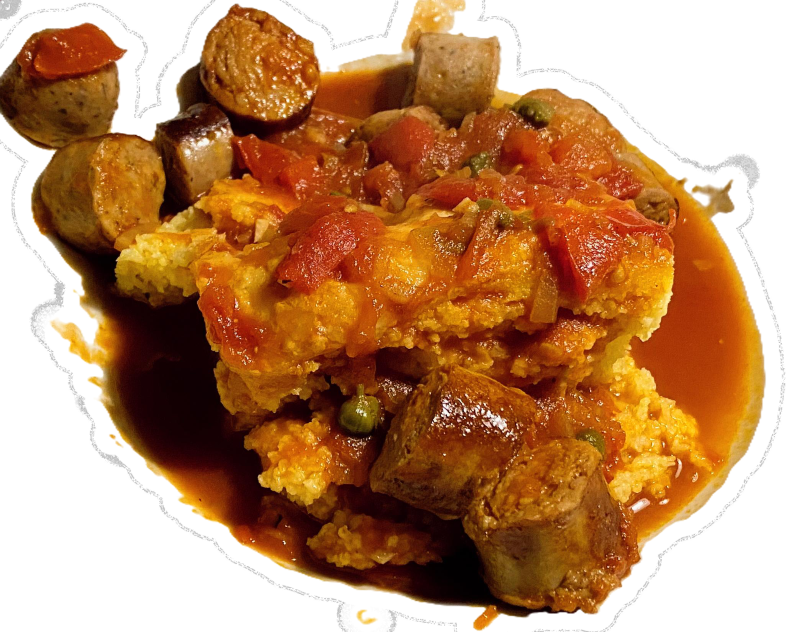

[← Zurück zu Rezepte](./)

[← Zurück zur Startseite](../)

# Bratwürstchen mit Tomatensoße und Kapern

## Zutaten (für 4 bis 6 Portionen)

*	ca. 600g grobe Bratwürstchen
*	1 große Zwiebel
*	2 Zehen Knoblauch
*	2 EL Rapsöl
*	250g frische Tomaten
*	1 Dose Tomaten in Stücke
*	200ml Rotwein
*	50g Kapern

## Zubereitung

*	In einer Pfanne Öl erhitzen und Bratwürstchen von allen Seiten scharf 
	anbraten. Bratwürstchen müssen nicht ganz durchgebraten werden, da sie 
	hinterher noch in der Tomatensoße köcheln.

*	Nach dem Anbraten, würstchen auf einem Teller mit Küchenkrepp zum Fett 
	abtropfen zwischenlagern.

*	In der gleichen Pfanne (zum aufnehmen der Röstaromen von den Bratwürstchen)
	die in sehr feine Würfel geschnittene Zwiebel mit dem Knoblauch gurz 
	anbraten.

*	Zwiebeln und Knoblauch mit den Dosentomaten ablöschen. Zusätzlich noch 
	Wasser (Tomatendose mit Wasser füllen) zum köcheln hinzugeben.
	
*	Die in groben Würfeln geschnittenen Tomaten und die ebenfalls in grobe 
	Stücke geschnittenen Bratwürstchen hinzugeben und für 10 bis 15 Minuten
	leicht köcheln lassen.
	
*	Abschließend noch den Rotwein und die Kapern hinzugeben und noch wenige 
	Minuten (ca. 3 bis 5 Minuten) köcheln lassen.

*	Heiß servieren und mit Salz und Pfeffer im Teller nachwürzen.

**TIPP**:

Passt sehr gut zu [Polenta mit Parmesan gratiniert](polenta) als Beilage.